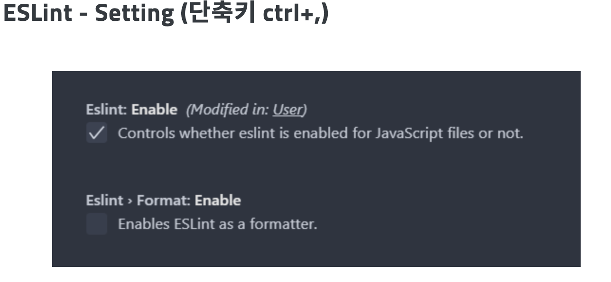

1. [공식 튜토리얼을 타스로 포팅해서 치기](https://ko.reactjs.org/tutorial/tutorial.html)
2. [이거 타스로 포팅해서 치기](https://react.vlpt.us/)
3. 인프라 관리 -> 도커 컴포즈,  CI, 학습.


학습 추천

1. 생활 코딩 react([링크](https://opentutorials.org/module/4058))
2. 이 강의 1장 리액트 입문([링크](https://react.vlpt.us/basic/01-concept.html))
3. 리액트 홈페이지 문서 hook(https://ko.reactjs.org/docs/hooks-overview.html)
4. 이 강의 2장(https://react.vlpt.us/styling/)

# 타스 스터디

declare : TS의 모듈 기능

[Js extends와 implements 의 차이](https://juunone.netlify.app/typescript/extends/)

react + TS 프로젝트 생성

```
npx create-react-app [Project name] --template typescrip
```


render()는 렌더링할 내용을 경량화한 React 엘리먼트를 반환한다.

JSX?


React 엘리먼트는 JavaScript 객체

super(props) : js에서 자식 객체의 생성자에서 항상 먼저 호출해야한다.

타스로 리엑트 쓸 때 프롭스를 어떻게 넘기지?

[블로그](https://velog.io/@ovogmap/React-Typescript-2)

린트/프리티어

[이 글이 찐인듯](https://sunmon.github.io/vscode-eslint-prettier-setting/)

[다했는데 vscode에서 저장 할 때 린트 안돌아가면?](https://minemanemo.tistory.com/98)

[타스에서 스테이트 생성자 안쓰고](https://stackoverflow.com/questions/51465921/react-typescript-constructor-state-vs-property)

[리엑트에서 똑똑하게 props를 관리하는방법](https://medium.com/humanscape-tech/react%EC%97%90%EC%84%9C-%EB%98%91%EB%98%91%ED%95%98%EA%B2%8C-props-%EA%B4%80%EB%A6%AC%ED%95%98%EA%B8%B0-dbea865f53)

[인터페이스 vs Type 예약어 차이](https://medium.com/@alexsung/typescript-type%EA%B3%BC-interface-%EC%B0%A8%EC%9D%B4-86666e3e90c)

React의 props, state 개념은 ES6 문법과 JavaScript Immutability 을 빼놓고 이해할 수 없다(원문: [리액트 공부  시 참고해야할 5가지](https://geniee.tistory.com/9))


21.08.09

[리액트의 보일러 플레이트 create-react-app](https://gocoder.tistory.com/2184?category=909967)

보일러 플레이트가 뭐지

> 컴퓨터 프로그래밍에서 보일러플레이트 또는 보일러플레이트 코드라고 부르는 것은 최소한의 변경으로 여러곳에서 재사용되며, 반복적으로 비슷한 형태를 띄는 코드를 말한다.

[Create-React-App 자세히 알아보자](https://velog.io/@cyheum/React-%EC%A0%95%EB%B3%B5%EA%B8%B0-create-react-app-%EB%8D%94-%EA%B9%8A%EC%9D%B4...-%EC%8B%A4%EC%A0%84-%EB%A6%AC%EC%95%A1%ED%8A%B8-%ED%94%84%EB%A1%9C%EA%B7%B8%EB%9E%98%EB%B0%8D-2)

WebSite는 어떻게 보여지게되는 걸까?

[반응형 웹 기본](https://bskyvision.com/786)

[반응형 웹 설계 기본](https://www.samsungsds.com/kr/insights/Responsive-Web-2.html)

[footer 항상 하단에 고정](https://gloriajun.github.io/style/2017/12/07/css-footer-fixed.html)

```css
.footer{
	position: fixed;
	bottom: 0;
	width: 100%;
}
```

## npm 학습

- node package manager
- 패키지?

### npm 과 npx 차이

npm은 의존성과 패키지 관리를 위한 패키지 매니저

[npx는 node 패키지를 실행시키는 하나의 도구](https://velog.io/@kimkyeseung/%EB%B2%88%EC%97%AD-%EA%B7%B8%EB%9E%98-npx-npm%EB%A7%90%EA%B3%A0-%EC%B0%A8%EC%9D%B4%EC%A0%90-%EC%84%A4%EB%AA%85)


node.js 가 자바스크립트 런타임이라는게 무슨말이지?

런타임?


react eslint 설치하기


# 리액트 TS 프로젝트 생성 + ESLINT PRETTIER 세팅


이 글은 create-react-app api를 사용하여 쉽고 빠르게 리액트 프로젝트를 생성하고, 프로젝트에 ESLintd와 Prettier를 세팅하여, 팀이 함께 리액트 프로젝트를 진행할 때 코드컨벤션을 쉽고 빠르게 적용할 수 있게 하기 위해 작성되었습니다.


## STEP1 리액트 TS 프로젝트 생성

node.js와 npm(node package manager) 가 설치되었는지 확인

```
node -v
npm -v
```

CRA(create-react-app) 을 사용하여 리액트 TS 프로젝트 생성

```
npx create-react-app my-app --template typescript
```

Vscode에서 ESlint 확장 설치 후 프로젝트 루트 디렉토리에 .eslintrc.json 파일 생성

```json
//.eslintrc.json

{
	"extends" : "react-app"
}
```

Vscode에서 prettier 확장 설치 후 ESlint 와 Prettier 연결

```
npm i prettier eslint-config-prettier eslint-plugin-prettier -D
```

Vscode 에서 cmd+shift+p 로 패털을 열고 setting.json을 열어

아래와 같이 설정을 변경/추가 해준다.

```
"editor.formatOnSave": true,
"editor.codeActionsOnSave": {
		"source.fixAll.eslint": true
	},
"eslint.alwaysShowStatus": true,
"files.autoSave": "afterDelay"
```

이 후 ESlint 및 Prettier 설정을 팀의 코드 컨벤션에 맞추면 된다.

> ⚠️ Vscode에서 .prettierrc와 eslint(prettier/prettier)의 싱크가 맞지 않는 문제가 발생하는 경우

vscode를 이용할 떄, prettierrc는 수정했으나 eslint에는 반영되지 않는 경우가 있다. 이런 경우, vscode를 재시작하면 변경된 prettierrc로 잘 적용된다. 참고 링크 (https://github.com/prettier/eslint-plugin-prettier/issues/103)


참고

[시간을줄이자React세팅](https://velog.io/@jonmad/%EC%8B%9C%EA%B0%84%EC%9D%84-%EC%A4%84%EC%9D%B4%EC%9E%90-React-Vscode-%EC%B4%88%EA%B8%B0%EC%84%B8%ED%8C%85)


리액트 학습

# JSX 문법 규칙

# Fragment

JSX로 컴포넌트를 작성할 때는 항상 하나의 태그로 감싸서 작성해야하는데, 이 때 이름 없이 태그를 작성하게되면 Fragment가 만들어진다. Fragment는 브라우저 상에서 따로 별도의 엘리먼트로 나타나지 않는다.

```react
function App() {
	<>
		<Hello />
		<div>안녕히계세요</div>
	</>
};
```


JSX 내부에서 자바스크립트 변수 사용시 `{}` 로 감싸서

```react
<div>{name}</div>
```


[TS에서 어떻게 react Wrapper 사용하는지](https://www.twilio.com/blog/intro-wrappers-typescript-react)

지라 아이템 연동 테스트


# react/ts project! - 공유 원격 레포지토리에 코드 컨벤션 세팅하기!


기본적인 react 프로젝트 설치가 완료된 후를 기준으로 합니다 :) 

## eslint  설치!

프로젝트 루트 디렉토리 (우리의 경우 front)에서 으로 설치

```
npm install -d eslint
eslint --init
```


우리는 리액트 + 타스 이므로 아래와 같이 세팅

>- to check syntax and find problems 
>- js modules
>- vue, react: react 
>- typescript : yes
>- browser
>- json

package.json의 devDependencies에 아래와 같이 패키지 추가됨.


.eslintrc.json 파일이 추가됨

프리티어도 깔자!

```
npm install --save-dev --save-exact prettier
```


eslint와 프리티어 붙이자!

```
npm install eslint-plugin-prettier@latest --save-dev // eslint와 prettier를 같이쓰게하는 플러그인
npm install --save-dev eslint-config-prettier # prettier와 겹치는 eslint 룰 삭제
npm install --save-dev eslint-plugin-prettier # eslint 기본 포맷 대신 프리티어 룰과 동일한 포매팅을 이용함
```


`.eslintrc`에 프리티어 확장팩을 설정한다. 뒤에 오는 설정이 앞을 덮어쓰기때문에 꼭 prettier가 뒤로 와야 한다!

```
"extends": ["eslint:recommended", "plugin:@typescript-eslint/recommended", "plugin:react/recommended", "plugin:prettier/recommended"],
```


프리티어 설정파일 만들기 

`.prettierrc.json` or js

프리티어 전체 옵션이다.(v1.19.1))  -- 팀원 논의 후 컨벤션 적용 필요

```
{
  "arrowParens": "avoid", // 화살표 함수 괄호 사용 방식
  "bracketSpacing": false, // 객체 리터럴에서 괄호에 공백 삽입 여부 
  "endOfLine": "auto", // EoF 방식, OS별로 처리 방식이 다름 
  "htmlWhitespaceSensitivity": "css", // HTML 공백 감도 설정
  "jsxBracketSameLine": false, // JSX의 마지막 `>`를 다음 줄로 내릴지 여부 
  "jsxSingleQuote": false, // JSX에 singe 쿼테이션 사용 여부
  "printWidth": 80, //  줄 바꿈 할 폭 길이
  "proseWrap": "preserve", // markdown 텍스트의 줄바꿈 방식 (v1.8.2)
  "quoteProps": "as-needed" // 객체 속성에 쿼테이션 적용 방식
  "semi": true, // 세미콜론 사용 여부
  "singleQuote": true, // single 쿼테이션 사용 여부
  "tabWidth": 2, // 탭 너비 
  "trailingComma": "all", // 여러 줄을 사용할 때, 후행 콤마 사용 방식
  "useTabs": false, // 탭 사용 여부
  "vueIndentScriptAndStyle": true, // Vue 파일의 script와 style 태그의 들여쓰기 여부 (v1.19.0)
  "parser": '', // 사용할 parser를 지정, 자동으로 지정됨
  "filepath": '', // parser를 유추할 수 있는 파일을 지정
  "rangeStart": 0, // 포맷팅을 부분 적용할 파일의 시작 라인 지정
  "rangeEnd": Infinity, // 포맷팅 부분 적용할 파일의 끝 라인 지정,
  "requirePragma": false, // 파일 상단에 미리 정의된 주석을 작성하고 Pragma로 포맷팅 사용 여부 지정 (v1.8.0)
  "insertPragma": false, // 미리 정의된 @format marker의 사용 여부 (v1.8.0)
  "overrides": [ 
    {
      "files": "*.json",
      "options": {
        "printWidth": 200
      }
    }
  ], // 특정 파일별로 옵션을 다르게 지정함, ESLint 방식 사용
}
```




### vscode CMD+SHIFT+P (명령 팔레트 열어서 setting.json 검색 후 실행)


### 아래 하이라이트 옵션 추가 또는 변경

- editior.formatOnSave : 저장 시 포매터 실행 여부
- eslint.run : onSave 저장시 발동!
- editor.defaultFormatter: 기본 포매터를 우리는 프리티어로 세팅!!


context API  : 리액트 공식문서, useContext, useMemo

context provider -> 전역적인 상태에 

react 상태관리도구, 